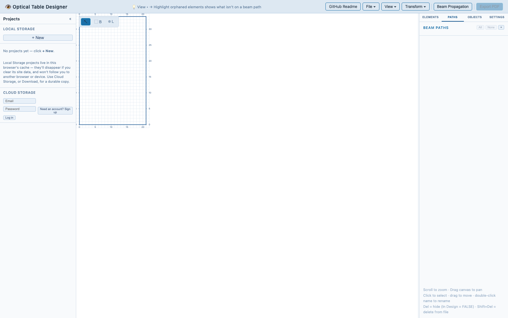

# Optical Table Designer

A browser-based tool for visualising and editing optical layouts on a 2D table diagram. Elements, beam paths, and background objects are stored as plain CSV/JSON files that round-trip cleanly with the lab's existing spreadsheets.

<p align="center">
  
</p>

<!-- Screenshots and GIFs live in docs/screenshots/. See docs/screenshots/README.md
     for filename conventions and quick capture tips. -->

## Features

- **Interactive canvas** — pan (drag), zoom (scroll), snap-to-grid placement
- **Elements** — add, move, rotate, and soft-delete optical elements; O-number labels and type annotations rendered on canvas
- **Beam paths** — draw and colour-code beam paths between elements; beams sharing the same pair of elements fan out automatically so none are hidden underneath another
- **Background objects** — overlay structural geometry (mounts, chamber ports, etc.)
- **Background images** — place reference photos or schematic screenshots beneath the layout with adjustable position, size, and opacity
- **Optics styles** — regex-matched symbol definitions map element type strings to SVG icons; 71 built-in symbols included
- **Search** — Cmd/Ctrl+F highlights matching elements and centres the view
- **Layers** — group elements onto named layers and show/hide them independently
- **In Design toggle** — elements can be hidden from the diagram without being deleted; restored via the Elements tab
- **Import** — upload individual CSV/JSON files or a whole project ZIP, by menu or drag-and-drop, with prompts to replace or append when the project already has data
- **Export** — vector PDF export; individual CSV/JSON downloads; full project ZIP
- **Projects panel** — a collapsible panel on the left lists every project, with Local Storage (everything in this browser) and Cloud Storage (optional) stacked so both are visible at once; switch, rename, duplicate, download or delete from the list, or right-click for the full set of commands
- **Cloud projects (optional)** — click **Sign in** at the top of the Cloud Storage section to save/load that account's projects from the cloud, from any computer; a per-project sync icon shows whether it's in sync, ahead, behind, or out of sync, and moving a project between Local and Cloud storage is one click away
- **Persistence** — layout state is saved to localStorage automatically

## Using online

The app is hosted at [opticaldesigner.netlify.app](https://opticaldesigner.netlify.app) — no install required, just open it in a browser.

By default there is no server-side storage: your layout lives entirely in that browser's **localStorage**, scoped to that domain. This means:

- Work persists automatically across page reloads and browser restarts, but only on the same browser/device you were using.
- Clearing site data/cookies for the domain, using a different browser, or going incognito will lose unsaved work.
- Nothing is uploaded anywhere — files never leave your machine unless you explicitly export/save them.

Use **File ▾ → Download Project** (or `Cmd/Ctrl+S`) to export your layout to a `.zip` whenever you want a durable, shareable copy outside the browser, or use the Projects panel's per-project Download — see [The Projects panel](#the-projects-panel-local--cloud-storage) below.

### The Projects panel: Local & Cloud Storage

A dedicated panel on the **left** side of the screen — separate from the right-hand sidebar's Elements/Paths/Objects/Settings tabs — is where you create, switch between, and manage projects. Click the **«** button in its header (or the thin strip's **»** when collapsed) to hide it into the left wall of the screen and get the canvas space back; the collapsed/expanded state persists across reloads. Drag its right edge to resize it, same as the sidebar. Local Storage and Cloud Storage are stacked one above the other in the same scrolling pane, so both are visible at once — no tab switching, and each project appears in only one of the two:

- **Local Storage** — every project in this browser that isn't linked to the cloud.
- **Cloud Storage** (optional) — a **Sign in** button if you aren't logged in, which opens a login/sign-up window; once logged in, every project you've linked to the cloud (with a sync icon), plus any cloud project not yet pulled into this browser.

**+ New** creates a project and switches to it right away; **Upload** loads a project `.zip` (same as **File ▾ → Upload Project…**). Click a project's name to open it; double-click (or right-click → **Rename**) to rename it in place. Right-click any project for the full menu: **Open, Rename, Duplicate, Download…, Move to Cloud…** / **Sync now** + **Move to Local…**, and **Delete…**. A **⇩** button downloads that one project as a `.zip`; **⇩ Download all** at the top of a section bundles every project shown into one `.zip`, each in its own folder.

<p align="center"></p>

#### Cloud storage (optional)

If the deployment has cloud storage configured (see [Cloud setup](#cloud-setup-optional) below), click **Sign in** at the top of the Cloud Storage section — it opens a login window with a toggle to switch to creating a new account. Once logged in:

- A cloud-linked project shows a small **sync icon** next to its name: ✓ in sync, ↑ ahead of the cloud (click to push), ↓ behind the cloud (click to pull), or **!** out of sync — both sides changed (click for **Keep mine**, **Use theirs**, or **Merge…**, which combines both sides field-by-field and flags anything it can't reconcile automatically).
- **Move to Cloud…** (right-click a Local Storage project) saves it to your account under a name you choose.
- **Move to Local…** removes the project from the cloud — **this deletes the shared copy**, so anyone else using this login loses access to it; the project itself stays right here, in this browser. You're warned before it happens.
- A cloud project not yet pulled into this browser (saved from another computer, or by a teammate) shows up in Cloud Storage marked "not pulled" — click it, or right-click → **Pull to Local Storage**, to bring it in. Cloud projects that only hold Beam Propagation plots and no actual layout don't show up here — there'd be nothing to pull.
- Cloud projects are **private to the account that created them** — Row Level Security on the backend means one account can never see or edit another account's cloud projects, even though every account uses the same public sign-up form.

This is entirely additive: Local Storage, localStorage persistence, and CSV/JSON/ZIP import-export all keep working exactly the same whether or not you're logged in, and a deployment without cloud storage configured simply shows a note in place of the **Sign in** button.

**To give a whole lab/team access to the same set of cloud projects**, don't create individual accounts — create one account and share those login credentials with everyone who should have access. Anyone with the credentials sees and edits that one account's project list; nobody else (including a stranger who signs up their own separate account on the public form) can see it. This also means you don't strictly need to disable public sign-up for data-privacy reasons — an uninvited signup just gets their own empty, useless project list — though you may still want to disable it under Supabase's Authentication → Settings to keep the user table tidy.

## User guide

### Editing modes

The canvas toolbar (bottom-left) switches between modes. The current mode determines what a click or drag on the canvas does.

<p align="center"></p>

| Mode | Enter | What it does |
|---|---|---|
| **Select** (default) | `Escape`, or the ↖ toolbar button | Click an element to select it; click empty canvas to deselect; drag empty canvas to pan; drag an element to move it |
| **Box Select** | `B`, or the ⬚ toolbar button | Drag a rectangle to select every element inside it |
| **Lasso Select** | `L`, or the ⌾ toolbar button | Freehand-drag a lasso; elements inside the closed shape are selected |
| **Move** | `M` (requires a selection), or the ✥ toolbar button, or simply drag a selected element | Drag selected element(s); snaps to the grid unless `Shift` is held; arrow keys nudge by one grid step |
| **Rotate** | `R` (requires a selection), or the ↻ toolbar button | Drag a selected element to rotate it about its own origin; snaps to 45° unless `Shift` is held; arrow keys rotate ±45° |

Two additional modes are entered from the sidebar rather than the toolbar:

- **Beam-path edit** — click the ✎ next to a path in the **Paths** tab. Click a source element, then a destination element, to add an edge between them; clicking an existing edge deletes it. Click the pending source again to cancel it. Exit with **Done** in the sidebar or `Escape`.
- **Background-object edit** — click the ✎ next to a group in the **Objects** tab. Click two points to draw a line segment (snaps to grid; `Shift`-click for a free point); click an existing segment to delete it. Text labels: type into the **Text labels** input, then click the canvas to drop that text at the grid position (uses the group's color). Click a placed label in edit mode to delete it. Exit with **Done** in the sidebar or `Escape`.

<p align="center"></p>

`Escape` always backs out one step at a time: it clears a pending point/edge first, then exits edit mode, then returns to Select.

#### Overlapping beams

When several beams run between the same two elements they would otherwise be drawn exactly on top of each other. Instead they are fanned out perpendicular to the direction of travel, evenly spaced and centred on the un-offset line — five beams render at −2, −1, 0, +1, +2 spacings. Only visible beams count toward the spread, so hiding one re-centres the remainder. A beam drawn A→B and another drawn B→A are treated as sharing the same corridor and fan out to opposite sides rather than overlapping.

The gap is the **Beam Paths → Overlap offset** setting (Settings tab, default `1`), stored as `beamSpacing` in `settings.json`. Set it to `0` to switch the fan-out off entirely.

### Keyboard shortcuts

Shortcuts are disabled while typing in a text field, except Cmd/Ctrl+F and Cmd/Ctrl+S, which always work.

| Shortcut | Action |
|---|---|
| `Cmd/Ctrl+F` | Open the search bar and jump to matching elements |
| `Cmd/Ctrl+S` | Download Project (saves the current layout as a `.zip`) |
| `Cmd/Ctrl+Z` | Undo the last change |
| `N` | Add a new element at the last cursor position, reusing the previously used type |
| `D` | Quick-add a new element at the cursor with the previously used type — no form step. Inherits rotation from the currently selected element if its type matches. |
| `P` | Bulk-set properties (Layer, Type, Orientation, In Design, custom columns) on every selected element |
| `B` / `L` / `M` / `R` | Switch to Box Select / Lasso / Move / Rotate mode |
| `Escape` | Cancel the current action / edit mode / selection tool, one step at a time |
| `Delete` or `Backspace` | Soft-delete selected elements (hides them, sets In Design = FALSE, keeps them in the file) |
| `Shift+Delete` or `Shift+Backspace` | Hard-delete selected elements (removes them entirely) |
| Arrow keys (Select or Move mode) | Nudge selected element(s) by one grid step |
| Shift + arrow keys | Rotate selected element(s) ±45° (Right/Down = +45°, Left/Up = −45°) — also the default in Rotate mode |
| `Shift` (while dragging/rotating) | Disables snapping for free positioning/angle |
| `Ctrl` / `Cmd` (while dragging) | Locks the drag to the dominant axis — pure horizontal or pure vertical motion |
| `Shift` + click | Add/remove an element from the current selection |
| `Shift` + drag (Box/Lasso Select) | Add the enclosed elements to the current selection instead of replacing it |

### Mouse & canvas controls

- **Scroll** to zoom in/out, centered on the cursor.
- **Drag empty canvas** to pan.
- **Click** an element to select it; **click empty canvas** to deselect.
- **Shift+click** an element to add/remove it from a multi-selection.
- **Drag** a selected element to move it (in Select or Move mode).
- **Double-click** a path, layer, or background-object name in the sidebar to rename it.
- **Double-click** a beam edge on the canvas to enter edit mode for that path.

### O-numbers are unique

Every element's O-number is enforced unique across all three ways one can be set:

- **Add Element form** — the O-number field turns red and **Add** is disabled while the typed label collides with an existing element.
- **Renaming** (sidebar detail panel or the Label column in **View ▾ → Elements**) — a blank or already-used O-number is rejected with an explanatory banner, and the field reverts.
- **Importing** — duplicates are renamed with a `_2`/`_3` suffix and a banner reports exactly what was renamed. This covers duplicates against existing elements *and* duplicates within the uploaded file itself.

Renaming an element also repoints any beam paths that referenced it, so beams stay connected.

### Editing a single element

Selecting exactly one element opens a detail panel at the bottom of the sidebar. Every field is editable there, including the **O-number** itself — edit it and press Enter (or click away) to commit. Renames are rejected if the new label is blank or already in use, and any beam paths referencing the element are repointed automatically.

O-numbers can also be edited in bulk-ish fashion from **View ▾ → Elements**, by editing the Label column.

### Bulk editing properties

Select several elements (Shift+click, Box Select, or Lasso) and press `P` to set properties across the whole selection at once — most usefully **Layer**, but also Type, Orientation, In Design, and any custom columns.

Each field is seeded with the value from the first selected element and starts unticked. Only ticked fields are written; editing a field ticks it automatically. `Escape` or **Cancel** closes without changing anything, and an applied change is a single `Cmd/Ctrl+Z` undo step.

### Sidebar tabs

<p align="center"></p>

- **Paths** — list beam paths, toggle visibility, add/rename/delete a path, edit its edges.
- **Elements** — add elements (by form, or press `N` at the cursor); manage layers (radio = active layer, checkbox = visibility); filter and multi-select from the full elements list; toggle In Design per element.

<p align="center"></p>

- **Objects** — background-object groups (chamber walls, mounts, etc.), same add/rename/delete/edit-edges pattern as Paths, plus a stroke-width control per group. Below that, a **Background Images** section for placing reference photos or diagram screenshots as a semi-transparent layer under the design: click **+** to upload, drag on the canvas to move, and use the X/Y/W/α/θ inputs to set exact position, width (in inches, height auto-preserves aspect), opacity, and rotation (degrees, clockwise); Flip ↔ / Flip ↕ buttons mirror the image without changing its rotation. Images ride along in project ZIP saves.

Project management (creating, switching, renaming, duplicating, downloading, and optional cloud sync) lives in the separate **Projects panel** on the left, not in this sidebar — see [The Projects panel](#the-projects-panel-local--cloud-storage) above.

<p align="center"></p>
- **Settings** — UI font size, canvas scale, table size/origin, grid display (grid lines, table bounding box, coordinate axis labels, line width), beam-path overlap offset, beam direction arrows, move-snap spacing, element label toggles (O-number, type, annotation), **Send labels to border** (moves every element's label out to the nearest map border with a leader arrow pointing back to the element — drag a label to slide it along the border, and it right-aligns on the left border, left-aligns on the right, centres on the top/bottom; positions are stored per element as `labelPos` and persist with the project), PDF export font size and label Y offset (nudges labels closer to icons at export time if the smaller PDF font makes them feel too far), and the Optics Styles symbol library editor (add/rename/delete symbol mappings, upload custom SVGs, per-style label clearance for icons whose label would otherwise overlap the drawing).

Drag the divider between the canvas and the sidebar to resize the sidebar.

### Search

`Cmd/Ctrl+F` opens a live search over element label/type; matches are highlighted on the canvas and the view centers on them. Close with `Escape` or the ✕ button.

### Viewing and editing raw data

**View ▾** in the header opens a spreadsheet-style modal for Elements, Beam Paths, or Background Objects. Click a cell to edit it inline, add/delete rows, and (for Elements) add or rename custom columns by double-clicking a header. `Tab` commits a cell and moves to the next column; `Escape` cancels an in-progress edit, or closes the modal if nothing is being edited.

**View ▾ → Highlight orphaned elements** is a toggle: elements that appear in at least one beam path fade back, and elements that don't are ringed in orange — useful for finding elements you forgot to wire into a beam or that got left behind after a rewire.

**Transform ▾** applies global operations to the whole project: rotate 90° left/right (also swaps table length/width so the layout stays inside the same footprint) and flip horizontal/vertical. Each transform is one undo step.

<p align="center"></p>

### Uploading and downloading files

**File ▾** has two sections:

- **Upload** — `Upload Elements…` / `Upload Paths…` / `Upload Objects…` / `Upload Settings…` load individual CSV/JSON files; `Upload Project…` loads a full `.zip` bundle (all files plus embedded custom symbols).
- **Download** — the matching per-file downloads, plus `Download Project` (also bound to `Cmd/Ctrl+S`) which exports everything as a `.zip`.

Creating, switching, renaming, duplicating and deleting projects, and (optionally) syncing them to the cloud, all live in the **Projects panel** on the left now — see [The Projects panel](#the-projects-panel-local--cloud-storage) above.

**Export PDF**, a button in the header rather than a menu item, renders the current layout to a vector PDF. The suggested filename defaults to the current project name.

**☾ Dark** / **☀ Light** in the header switches the whole app's theme.

<p align="center"></p>

### Beam Propagation

Gaussian-beam propagation isn't part of the designer itself — use the standalone app at [beampropagation.netlify.app](https://beampropagation.netlify.app) (source in [webapp/beampropagation](webapp/beampropagation)). It imports a beam path straight from a designer project `.zip` (**File ▾ → Download Project** here, then **Upload from project .zip** there) with real inter-element distances and lens focal lengths pre-filled, and shares the designer's cloud projects and login when cloud storage is configured (see its [README](webapp/beampropagation/README.md#cloud-storage-optional)). A step-by-step [User Guide](webapp/beampropagation/USER_GUIDE.md) covers it in full.

#### Merging uploads into an existing project

Uploading Elements, Paths, or Objects into a project that already has data prompts you to **Replace** the existing data or **Append** the uploaded data to it. Appending elements that collide with existing O-numbers prompts you to **Auto-resolve** (renames colliding labels, e.g. `O-12` → `O-12_2`) or **Resolve manually**, which steps through each collision one at a time so you can pick its new label.

Uploading a whole project `.zip` first asks how to bring it in:

- **Open as New Project…** — prompts for a name, then loads the uploaded files as a separate new project, leaving the current project's saved slot untouched.
- **Overwrite Current Project…** — merges the ZIP into the current project, asking about each part in turn: Replace/Append/Skip for elements, then beam paths, then background objects (with the same O-number collision handling as above), and finally whether to **Overwrite settings** (canvas scale, table size, grid, symbol library, layers) or **Keep current**.

#### Drag and drop

You can **drag and drop** a `.csv`, `.json`, or `.zip` file anywhere onto the app to upload it — the file type is inferred from its name (e.g. `elements.csv`, `beam_paths.csv`, `background_objects.csv`) or, failing that, from its header row. If a dropped CSV can't be identified either way, a dialog asks you to pick Elements, Beam Paths, or Background Objects. Dropped `.zip` files go through the same project-upload prompts described above.

## File formats

The project uses four files, all human-readable and compatible with standard spreadsheet software.

### `elements.csv`

One row per optical element. Core columns:

| Column | Description |
|---|---|
| Label | O-number identifier (e.g. `O-42`) |
| Type | Free-text type string matched against optics styles |
| Position x / y | Physical coordinates in inches |
| Orientation | Angle in degrees (0 = +x, counter-clockwise positive) |
| In Design | `TRUE` = visible on diagram, `FALSE` = hidden |

Any additional columns (wavelength, beam path, cleaning status, etc.) are preserved on round-trip and shown in the element detail panel.

A `# config:` comment on the first line can store table dimensions and origin:
```
# config: table_length=55,table_width=85,origin_x=0,origin_y=0
```

### `beam_paths.csv`

One row per beam-path edge. Rows are sorted by name when saved.

| Column | Description |
|---|---|
| Name | Beam path name |
| Color | Hex colour |
| Src | Source element label |
| Dest | Destination element label |

```
Name,Color,Src,Dest
Cs MOT,#e06c75,O-17,O-98
Cs MOT,#e06c75,O-98,O-250
Li H Imaging,#61afef,O-527,O-502
```

### `background_objects.csv`

Line segments grouped by name (chamber walls, mounts, etc.):

| Column | Description |
|---|---|
| Group | Group name |
| Color | Hex colour |
| StrokeWidth | Line width in canvas pixels |
| x1, y1, x2, y2 | Endpoint coordinates in inches |

### `settings.json`

Stores canvas settings, table config, and optics style definitions. Optics styles map type-name patterns (supports `*wildcards*`) to SVG symbol files.

## Local development

The app is a static single-page React app (Vite + React 19). There's no backend to stand up for local/offline use — everything runs in the browser against local files/localStorage. Cloud projects are an optional add-on backed by [Supabase](https://supabase.com); see [Cloud setup (optional)](#cloud-setup-optional) below. Without it configured, the app behaves exactly as before.

### Prerequisites

- Node.js (Vite 8 requires a current LTS release; Node 20+ recommended)
- npm

### Setup

```bash
cd webapp/frontend
npm install
```

### Dev server

```bash
npm run dev
```

Starts Vite's dev server with hot module reload, by default at `http://localhost:5173`. Edit any file under `src/` and the browser updates automatically.

### Production build

```bash
npm run build
```

Type-checks and bundles the app into `webapp/frontend/dist/` — the same command Netlify runs (`command` in [`netlify.toml`](netlify.toml)).

```bash
npm run preview
```

Serves the built `dist/` output locally so you can sanity-check a production build before pushing.

### Lint

```bash
npm run lint
```

Runs ESLint over the `src/` tree.

## Cloud setup (optional)

Cloud projects (per-account save/load, see [Cloud storage](#cloud-storage-optional) above) run on [Supabase](https://supabase.com) — a hosted Postgres database, auth, and file storage. The frontend talks to it directly from the browser; no server code is needed, so the app stays a static Netlify deploy either way.

1. Create a Supabase project and note its **Project URL** and **anon public key** (Project Settings → API). The anon key is meant to be exposed client-side — access control comes from the Row Level Security policies below, not from keeping the key secret.

   On the project-creation "Security" screen: leave **Enable Data API** checked (required — it's what `supabase-js` talks to). **Automatically expose new tables** and **Enable automatic RLS** can be left at Supabase's recommended values (off) — the SQL below grants API access and enables RLS explicitly either way, so neither project-wide setting is load-bearing here.
2. In the Supabase SQL Editor, run:

   ```sql
   create table public.cloud_projects (
     id               uuid primary key,
     name             text not null,
     state            jsonb not null,
     created_at       timestamptz not null default now(),
     updated_at       timestamptz not null default now(),
     created_by       uuid references auth.users(id),
     created_by_email text,
     updated_by       uuid references auth.users(id),
     updated_by_email text
   );

   alter table public.cloud_projects enable row level security;

   -- Base table privileges for the API roles. Needed explicitly if your project
   -- has "Automatically expose new tables" turned off (Project Settings →
   -- API → Security) — RLS policies alone don't grant access; RLS only
   -- restricts access that a role already has. Harmless to run even if that
   -- setting is on.
   grant select, insert, update, delete on public.cloud_projects to authenticated;

   -- Owner-scoped: an account can only see/change its own rows. `with check`
   -- on insert/update stops a client from writing a row claiming a different
   -- owner than its own auth.uid().
   create policy "owner select" on public.cloud_projects
     for select to authenticated using (created_by = auth.uid());
   create policy "owner insert" on public.cloud_projects
     for insert to authenticated with check (created_by = auth.uid());
   create policy "owner update" on public.cloud_projects
     for update to authenticated using (created_by = auth.uid()) with check (created_by = auth.uid());
   create policy "owner delete" on public.cloud_projects
     for delete to authenticated using (created_by = auth.uid());

   create or replace function public.set_updated_at()
   returns trigger language plpgsql as $$
   begin
     new.updated_at = now();
     return new;
   end;
   $$;
   create trigger cloud_projects_set_updated_at
     before update on public.cloud_projects
     for each row execute function public.set_updated_at();

   insert into storage.buckets (id, name, public) values ('project-images', 'project-images', false);

   -- storage.objects.owner is set automatically by Supabase Storage to the
   -- uploader's auth.uid(), so background images get the same per-account
   -- scoping with no path restructuring needed.
   create policy "owner read project images" on storage.objects
     for select to authenticated using (bucket_id = 'project-images' and owner = auth.uid());
   create policy "owner write project images" on storage.objects
     for insert to authenticated with check (bucket_id = 'project-images' and owner = auth.uid());
   create policy "owner update project images" on storage.objects
     for update to authenticated using (bucket_id = 'project-images' and owner = auth.uid());
   create policy "owner delete project images" on storage.objects
     for delete to authenticated using (bucket_id = 'project-images' and owner = auth.uid());
   ```

   Each account can only read and write its own rows and images — see [Cloud storage](#cloud-storage-optional) above for how a team shares one pool of projects anyway (share one account's login).
3. Under Authentication → Providers, confirm Email is enabled (it is by default). Optionally, under Authentication → Settings, disable "Confirm email" so people can sign up without a confirmation round-trip, and/or disable "Allow new users to sign up" entirely once you've created whatever account(s) you need — neither is required for data privacy (see above), just tidiness.
4. Copy `webapp/frontend/.env.example` to `webapp/frontend/.env.local` and fill in `VITE_SUPABASE_URL` / `VITE_SUPABASE_ANON_KEY` for local dev.
5. For the deployed site, add the same two variables in Netlify under Site configuration → Environment variables, then trigger a redeploy (env vars only take effect on the next build, not retroactively).

## Deployment

The app is deployed via Netlify from this repository. Any push to `main` triggers a new build automatically. Build configuration is in [`netlify.toml`](netlify.toml).

## Example files

The [`webapp/example_files/`](webapp/example_files/) directory contains a sample layout that can be loaded from the **File ▾ → Upload** menu, or by dragging the files onto the app.

`settings.json` from that folder also doubles as the app's **new-project defaults** — table size, appearance settings, and the optics-style symbol mappings that every brand-new project (and a fresh install with no saved state) starts with. Edit that file to change what "blank" means for this deployment.

## Credits and license

The project code and homemade symbols (`h-*.svg`) are released under the [MIT License](LICENSE).

The optical component SVG symbols (`b-*`, `c-*`, `e-*`) are taken from the [Component Library](https://www.gwoptics.org/ComponentLibrary/) by Alexander Franzen, used here under the [Creative Commons Attribution-NonCommercial 3.0 Unported](https://creativecommons.org/licenses/by-nc/3.0/) license. Any use of those symbol files must comply with CC BY-NC 3.0.


## Updating homemade symbols

```
python3 webapp/ComponentLibrary_files/strip_svg_metadata.py \
  --fit-viewbox \
  --sync-symbols-js webapp/frontend/src/utils/symbols.js \
  --out-dir webapp/frontend/public/symbols \
  webapp/ComponentLibrary_files/homemade/*.svg
```