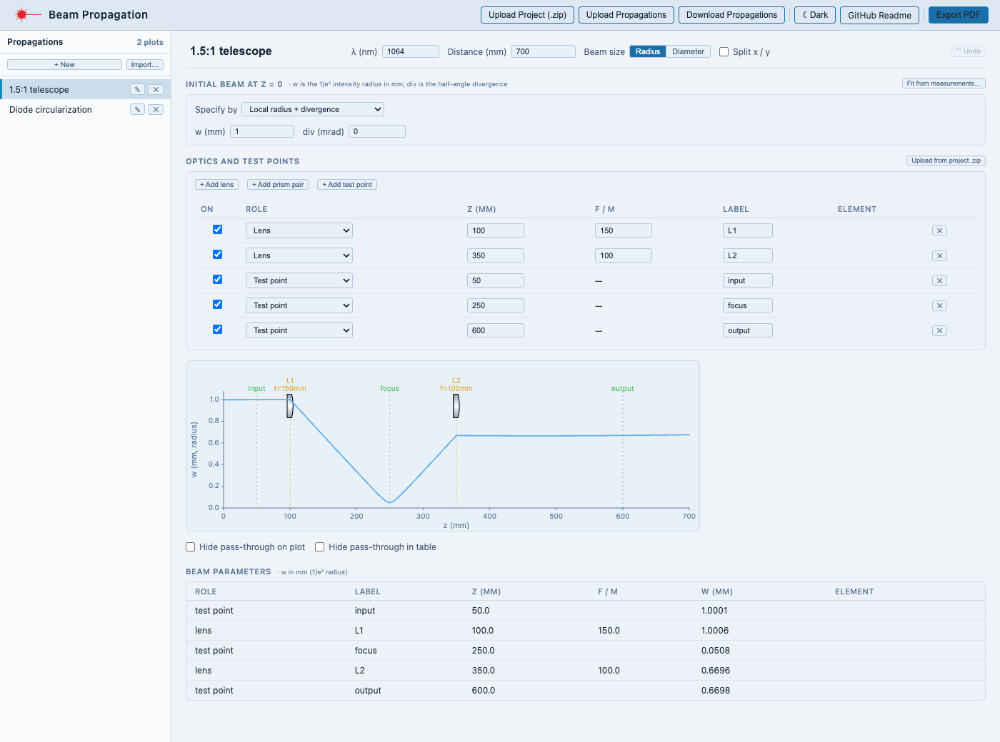

# Beam Propagation

A browser-based Gaussian-beam sandbox: compute the beam radius w(z) through a sequence of thin lenses, cylindrical lenses and prism pairs, fit a beam waist from measured widths, and optionally pull the layout in from an [Optical Table Designer](../../README.md) project.

Hosted at [beampropagation.netlify.app](https://beampropagation.netlify.app). By default nothing is uploaded anywhere — everything runs in your browser and is kept in that browser's localStorage. If the deployment has cloud storage configured, you can also log in and save plots to the cloud (see [Cloud projects](#cloud-projects-optional)).

**New here? Read the [User Guide](USER_GUIDE.md)** — a step-by-step walkthrough with screenshots. This README is the feature summary and the setup / deployment notes.

<p align="center"></p>

This began as a **Beam Propagation** mode inside the Optical Table Designer; that embedded mode has since been removed there, and beam propagation now lives only in this standalone app. It can still import a beam path from a designer project export (see [Relationship to the designer](#relationship-to-the-designer)).

## Features

- **Gaussian propagation** — complex q-parameter with ABCD matrices for free space, thin lenses and prism pairs, computed separately for x and y
- **Optics and test points** — one table holds everything along the beam: spherical, cylindrical-x and cylindrical-y lenses, **prism pairs** (anamorphic expander along X or Y with magnification M, applying q → M²·q on that axis), pass-throughs, and **test points** (a marked z where the beam size is reported). Pick the type in the *Role* column.
- **Radius or diameter** — the **Beam size** toggle in the top row switches every size shown or entered — the initial beam, the plot's y-axis, the results table, the fit report and the PDF — between the 1/e² intensity radius w and diameter D. In diameter mode the divergence is the full angle (2× the half-angle used in radius mode), so size and slope stay consistent. It is saved with each propagation.
- **Interactive plot** — drag any optic's dashed line (or its icon) horizontally to change its z, and a test point's green dashed line (or its label) likewise; drag a lens icon vertically to change f, or a prism-pair icon vertically to change M
- **Per-optic On toggle** — untick an optic in the table to skip it in the propagation without deleting it (its icon and row stay, dimmed); for a test point it hides the marker from the plot
- **Initial beam** — either **local radius + divergence at z = 0** or **waist size + waist z position**
- **Fit from measurements** — enter profiled beam widths at several z positions (paste 2-column `z, w` or 3-column `z, wₓ, w_y` straight from Excel, or drop a CSV file onto the dialog / use **Upload CSV** — a header row is ignored); the ideal-Gaussian formula w(z)² = w₀²·(1 + ((z − z₀)/z_R)²) is fit to give w₀, z₀ and z_R, which are applied to the initial beam
- **Split x / y** — render the two axes stacked or overlaid
- **Gridlines** — an optional **Show gridlines** toggle overlays faint horizontal/vertical guides at the plot's tick marks
- **Import from a designer beam path** — **Upload from project .zip** (next to the optics table heading) reads only the layout from a designer project and opens the path picker, so any propagations inside the zip are ignored; any beam path becomes a propagation with real inter-element distances and lens focal lengths (see the [User Guide](USER_GUIDE.md#import-a-beam-path-from-the-optical-table-designer))
- **Multiple propagations** — each plot lives in its own entry in the left rail; double-click to rename
- **Undo** — `Cmd/Ctrl+Z`; **Save** — `Cmd/Ctrl+S` downloads `propagations.json`
- **Export** — vector PDF of the active propagation; `propagations.json` download
- **Projects rail (optional)** — **+ New**, **Upload** (a `propagations.json` saved earlier) and **⇩ Download all** sit in one row above **Local Storage** (every propagation in this browser not linked to the cloud) and **Cloud Storage** (every one that is), stacked one above the other in the same left rail so both are visible at once, with a per-item sync icon (in sync / ahead / behind / out of sync — click to resolve), right-click for rename / duplicate / download / move to cloud or local / delete, and one-click download of a single propagation or all of them. Click **Sign in** at the top of Cloud Storage to open the login/sign-up window; opens the Optical Table Designer's cloud projects too. Click **«** in the rail header (or the collapsed strip's **»**) to hide it into the left wall and get the plot area back, or drag its right edge to resize — the collapsed state and width persist across reloads
- **Persistence** — plots and the loaded project are saved to localStorage automatically
- **Light / dark theme** toggle in the header

## Using it

The [User Guide](USER_GUIDE.md) covers everything in detail. In short:

1. Click **+ New** in the left rail.
2. In the top row set the wavelength, the distance to plot over, and whether beam size is shown as radius or diameter.
3. Set the initial beam, then add lenses, prism pairs and test points to the optics table (or drag icons on the plot).
4. **Export PDF** (header) for a print-ready plot, or the rail's **⇩ Download all** (or `Cmd/Ctrl+S`) to keep your plots as a `propagations.json`.

To work from an Optical Table Designer layout, click **Upload from project .zip** next to the *Optics and test points* heading (or pull one from Cloud Storage) — see [Import a beam path](USER_GUIDE.md#import-a-beam-path-from-the-optical-table-designer). `.zip` and `.csv` files can also be dropped anywhere on the page.

Every propagation lives in **Local Storage** in this browser, so it survives reloads but not clearing site data or switching browser/computer — right-click **Download…** (or Cloud Storage) for a durable copy. A project with very large custom symbols can exceed the browser's storage quota; the session still works, but the project would need to be re-uploaded after a reload.

### Cloud storage (optional)

When the deployment has cloud storage configured (see [Cloud setup](#cloud-setup-optional)), the rail's **Cloud Storage** section (stacked below Local Storage) shows a **Sign in** button that opens a login/sign-up window; once logged in it lists any propagation you've linked to the cloud, plus any cloud project not yet pulled into this browser. It uses the **same accounts and cloud projects as the Optical Table Designer**: pulling a designer project's cloud row brings in its propagations, and pushing back updates only the propagations, leaving the rest of that project untouched. See [Projects rail](USER_GUIDE.md#the-projects-rail-local-and-cloud-storage) in the User Guide for the full walkthrough, including sync status, bundles, and what happens when someone else has changed the cloud project meanwhile.

## Relationship to the designer

Beam propagation used to also live inside the Optical Table Designer as its own mode, sharing this app's propagation component and Gaussian maths (`gaussian.js`). That embedded copy has been removed from the designer — beam propagation now lives only here, as a standalone app.

What the designer still provides is **layout data to import from**: this app reads a designer project `.zip` (elements, beam paths, symbol definitions — via a small shared slice of `csvUtils.js`, `ElementShape.jsx` and `symbols.js`) to turn a beam path into a propagation with real inter-element distances and lens focal lengths. It never reads or writes the designer's own files (`elements.csv`, `beam_paths.csv`, `settings.json`) beyond that one-way import, and the designer no longer has any propagation data of its own to read back.

The two apps do still share the same Supabase backend — see [Cloud storage](#cloud-storage-optional) below — so a designer project's cloud row can carry propagations pushed here, even though the designer itself never writes or displays them.

## Development

```bash
cd webapp/beampropagation
npm install
npm run dev        # http://localhost:5173
npm run build      # production build into dist/
npm run lint
```

## Cloud setup (optional)

Cloud projects need no new backend: they use the **same Supabase project as the Optical Table Designer** — its `cloud_projects` table, accounts and Row Level Security. If the designer's cloud storage is already set up (see [Cloud setup](../../README.md#cloud-setup-optional) in the main README), all that's left is to give this app the same two values:

1. Copy `.env.example` to `.env.local` and fill in `VITE_SUPABASE_URL` and `VITE_SUPABASE_ANON_KEY` (the same values as `webapp/frontend/.env.local`) for local development.
2. For the deployed site, add the same two variables in Netlify under Site configuration → Environment variables, then trigger a redeploy — environment variables only take effect on the next build.

Without them the app runs local-only — the Cloud Storage section just explains that cloud storage isn't configured, with no errors. The anon key is meant to be public; access is controlled by the Row Level Security policies on the table.

## Deployment (Netlify)

The app is a static Vite build with no server. (The only environment variables are the optional Supabase ones above.) It is deployed as its **own Netlify site**, separate from the designer's, from the same GitHub repository.

1. **Push to GitHub.** Netlify builds from the repository, so `webapp/beampropagation` must be on the branch it deploys (`main`).
2. **Create the site.** In Netlify: *Add new site → Import an existing project → GitHub*, then pick this repository.
3. **Build settings** — set the **Base directory** to `webapp/beampropagation`. The build command (`npm install && npm run build`) and publish directory (`dist`) come from [netlify.toml](netlify.toml) in this folder; if Netlify shows them as empty fields, enter those two values.
4. **Environment variables** (optional, only for cloud storage) — under *Site configuration → Environment variables* add `VITE_SUPABASE_URL` and `VITE_SUPABASE_ANON_KEY`, the same values the designer's site uses. Do this before the first deploy, or trigger a redeploy afterwards.
5. **Deploy**, then rename the site under *Site configuration → Site details → Change site name* to `beampropagation`, which gives [beampropagation.netlify.app](https://beampropagation.netlify.app) (if that name is free).
6. **Check it**: the page loads, **Upload from project .zip** (in the optics table) followed by picking a beam path works, and — if you set the variables — the rail's **Cloud Storage** section shows a **Sign in** button and logging in with the lab account works.

**Which `netlify.toml` is used?** The repository root also has one (for the designer, with `base = "webapp/frontend"`). Netlify looks for the config file in the package directory, then the *base directory*, then the repository root, and uses the first one it finds — so with the base directory set as above, this folder's file is used and the root one is ignored. If a deploy log ever shows it building `webapp/frontend`, the base directory isn't set.

A push to `main` triggers a build of **both** Netlify sites, since they share the repository. That is harmless — each builds only its own folder — but if the extra builds bother you, Netlify's *ignore builds* setting can skip a site's build when nothing in its folder changed.

## Documentation images

`docs/screenshots/` holds the images used by the User Guide and this README, and `docs/example-measurements.csv` is a sample data set for the *Fit from measurements* dialog. The repository's top-level `.gitignore` excludes `*.png`; this folder's own `.gitignore` re-includes the screenshots.
