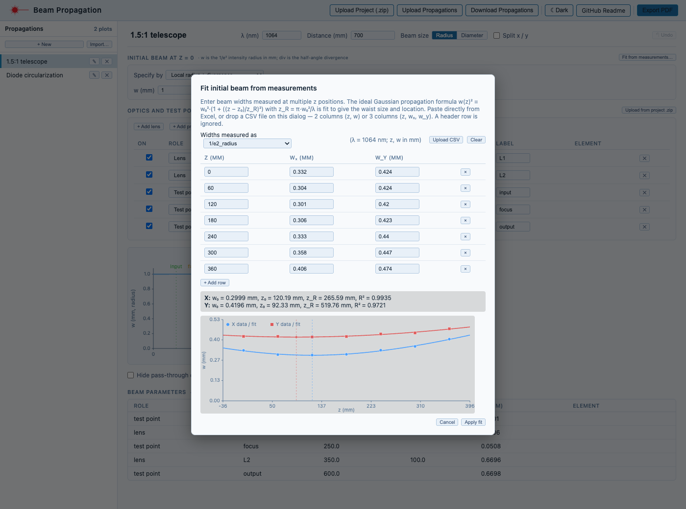
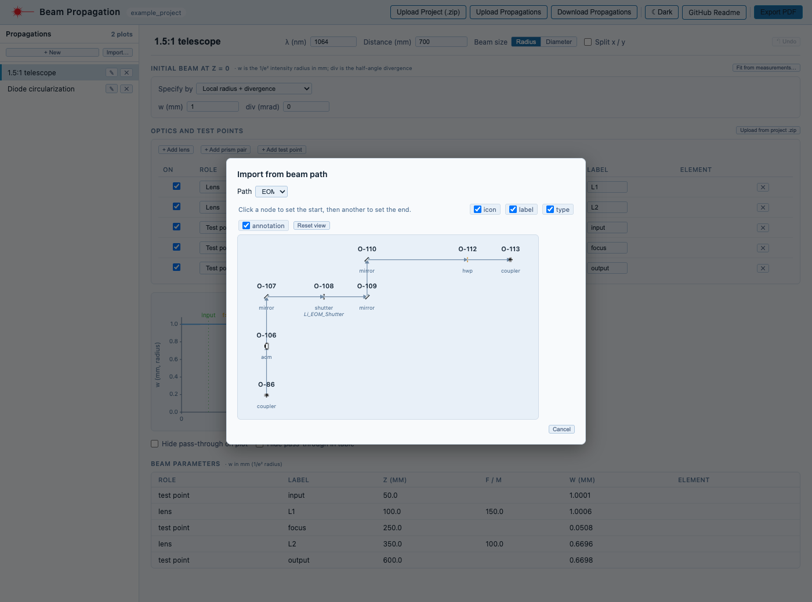
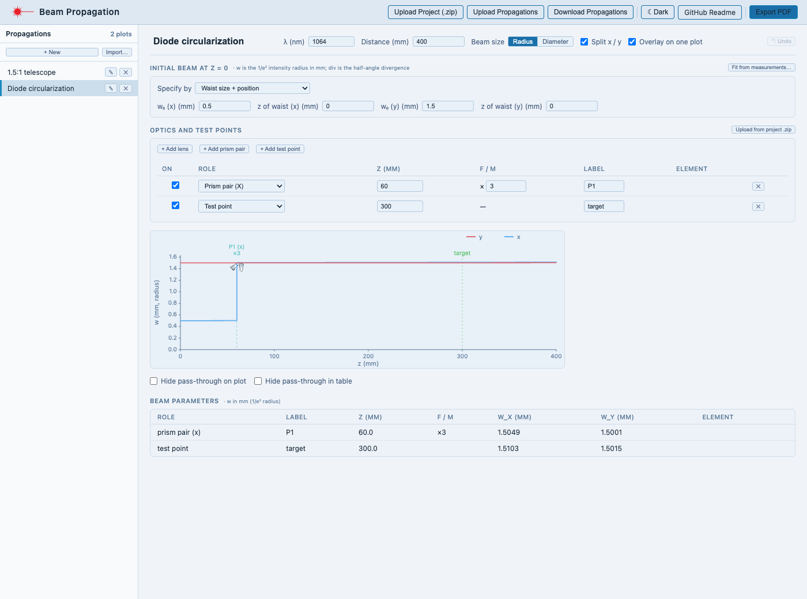
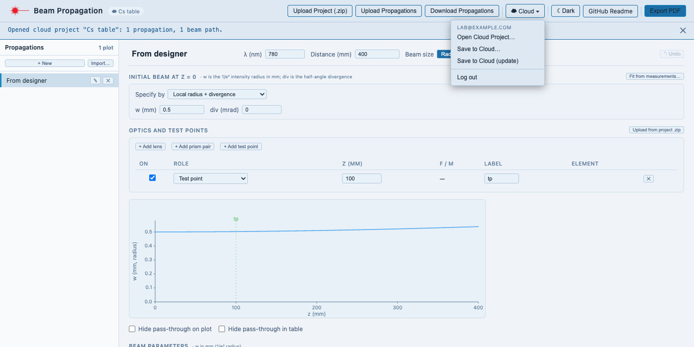

# Beam Propagation — User Guide

Beam Propagation shows how the size of a Gaussian laser beam changes along its path through lenses, prism pairs and free space. Use it to plan a telescope, find where a lens must go to focus a beam, check a beam size at a test point, or work out your input beam from profiler measurements.

It runs in your browser at [beampropagation.netlify.app](https://beampropagation.netlify.app) — nothing to install. This guide is for using the tool. For setting up, developing or deploying it, see the [README](README.md).

**Contents**

1. [What it models](#1-what-it-models)
2. [Quick start: a 1.5:1 telescope](#2-quick-start-a-151-telescope)
3. [The screen](#3-the-screen)
4. [How to…](#4-how-to)
   - [Switch between beam radius and diameter](#switch-between-beam-radius-and-diameter)
   - [Find your input beam from profiler measurements](#find-your-input-beam-from-profiler-measurements)
   - [Import a beam path from the Optical Table Designer](#import-a-beam-path-from-the-optical-table-designer)
   - [Work with elliptical beams: cylindrical lenses and prism pairs](#work-with-elliptical-beams-cylindrical-lenses-and-prism-pairs)
   - [Save, share and export](#save-share-and-export)
5. [Reference](#5-reference)
6. [Troubleshooting](#6-troubleshooting)

---

## 1. What it models

The tool follows an **ideal Gaussian beam** (a perfect TEM₀₀ mode, M² = 1) along a straight line called **z**, measured in millimetres from the start of the plot (z = 0).

| It handles | Notes |
|---|---|
| Free space | Refractive index 1, so distances are just distances. |
| Thin lenses | Spherical, or cylindrical (focusing along x or y only). Positive f converges, negative f diverges. |
| Prism pairs | An ideal anamorphic magnifier along x or y: it enlarges that axis's beam by a factor M and shrinks its divergence by M. |
| Test points | Marked z positions where you want the beam size reported. |

It does **not** model lens thickness, aberrations, apertures or clipping, beam quality M² > 1, loss, or rotated (off-axis) cylindrical lenses. The x and y axes are independent of each other.

**Units:** distances in **mm**, wavelength in **nm**, divergence in **mrad**. Beam size is the **1/e² intensity radius** (called w) by default, or the diameter (D) if you switch — see [Switch between beam radius and diameter](#switch-between-beam-radius-and-diameter).

---

## 2. Quick start: a 1.5:1 telescope

We'll shrink a 1 mm-radius collimated beam by 1.5× using two lenses: f = 150 mm, then f = 100 mm placed so the beam is collimated again.

1. Click **+ New** in the left rail. A new propagation opens.
2. In the top row set **λ** to `1064` and **Distance** to `700`. (Distance is how far along z the plot runs.) Leave **Beam size** on *Radius*.
3. Under **Initial beam at z = 0**, keep *Local radius + divergence* and set **w** to `1` and **div** to `0`.
4. Under **Optics and test points**, click **+ Add lens** twice. Set the first to **z** `100`, **f / M** `150`, **Label** `L1`; the second to **z** `350`, **f / M** `100`, **Label** `L2`.
5. Click **+ Add test point** three times and set them to z `50` (`input`), `250` (`focus`) and `600` (`output`).

The plot and the **Beam parameters** table update as you type:

| Row | z (mm) | w (mm) |
|---|---|---|
| input | 50 | 1.0001 |
| L1 (f = 150) | 100 | 1.0006 |
| focus | 250 | 0.0508 |
| L2 (f = 100) | 350 | 0.6696 |
| output | 600 | 0.6698 |

The beam is focused to a 51 µm radius between the lenses, then re-collimated at 0.67 mm — the expected f₂/f₁ = 100/150 ratio.

Now try dragging: grab a lens's dashed line and drag left or right, and its z changes in the table. Drag a lens *icon* up or down to change f. [The plot](#the-plot) explains all the drag handles.

Your work is saved in this browser automatically. To keep or share it, see [Save, share and export](#save-share-and-export).

---

## 3. The screen

### Top bar

| Button | What it does |
|---|---|
| **Upload Project (.zip)** | Opens a whole Optical Table Designer project: its layout becomes available to **Import…**, and any propagations saved inside it are offered to you (you choose **Replace**, **Add** or **Skip** if you already have plots open). To take only a beam path and leave your plots alone, use **Upload from project .zip** in the optics table instead — see [Import a beam path](#import-a-beam-path-from-the-optical-table-designer). |
| **Upload Propagations** | Loads a `propagations.csv` saved earlier. |
| **Download Propagations** | Saves all your plots as `propagations.csv`. Shortcut: `Cmd/Ctrl+S`. |
| **Log in** / **☁ Cloud ▾** | Cloud storage, if your deployment has it — see [Cloud projects](#cloud-projects). |
| **☾ Dark** / **☀ Light** | Switches theme. |
| **Export PDF** | Exports the open propagation as a PDF. |

You can also drop a `.zip` or `.csv` file anywhere on the page to upload it.

### Left rail

Each plot you work on is its own **propagation**, listed here. Click one to open it; double-click its name (or press ✎) to rename; ✕ deletes it (**Undo** brings it back). **+ New** starts a blank one, and **Import…** starts one from a designer beam path (it asks for a project `.zip` first if none is loaded).

### Top row

These settings belong to the open propagation:

- **Name** — click to edit.
- **λ (nm)** — wavelength.
- **Distance (mm)** — the plot runs from z = 0 to this distance. Optics and test points outside that range are ignored.
- **Beam size — Radius / Diameter** — how beam size is shown and entered everywhere.
- **Split x / y** — treat the x and y axes separately (needed for cylindrical lenses and prism pairs). **Overlay on one plot** then puts both on one plot (x blue, y red); untick it for two stacked plots.
- **↻ Reimport** (only on imported plots) and **↶ Undo** (`Cmd/Ctrl+Z`).

### Initial beam at z = 0

Describe the beam where the plot starts. Two ways:

- **Local radius + divergence** — the beam's size at z = 0 (**w**) and how fast it is changing there (**div**, the half-angle in mrad; positive means growing, negative means shrinking towards a focus). `div = 0` means z = 0 is exactly at a waist.
- **Waist size + position** — the waist size **w₀** and the z where it sits (**z of waist**, which may be negative if the waist is upstream of z = 0). This is the natural form if you know your laser's waist, and it is what **Fit from measurements…** produces.

With **Split x / y** on, you enter x and y values separately.

### Optics and test points

One table holds everything along the beam. The **Upload from project .zip** button at the right of its heading starts an [import from a designer project](#import-a-beam-path-from-the-optical-table-designer).

| Column | Meaning |
|---|---|
| **On** | Untick to skip the item without deleting it (for a test point, this hides its marker). |
| **Role** | What it is — see below. |
| **z (mm)** | Position along the beam. |
| **f / M** | Focal length in mm for a lens (negative = diverging), or magnification ×M for a prism pair. |
| **Label** | A name shown on the plot and in the results. |
| **Element** | Filled in for imported items: the designer element it came from. |

**Roles:**

| Role | Effect |
|---|---|
| Lens | Spherical thin lens; acts on x and y. |
| Lens (Cyl. X) / (Cyl. Y) | Focuses only one axis. Needs **Split x / y**. |
| Prism pair (X) / (Y) | Magnifies that axis's beam by M (and divides its divergence by M). Needs **Split x / y** — adding one turns it on for you. |
| Test point | No effect on the beam; reports beam size at its z. |
| Pass-through | No effect; a placeholder, mostly for imported non-lens elements (mirrors, waveplates…). Hidden from the table until you tick **Show pass-through**. |

The table stays in the order you added things; the physics always sorts by z.

### The plot

The plot shows beam size against z. Lenses and prism pairs appear as icons at the top with their labels and values; test points are green dashed lines with a label above; if you used **Fit from measurements**, the measured points appear as dots (x) and squares (y).

Most things can be adjusted by dragging:

| Drag… | To change |
|---|---|
| Any optic's **dashed line** ← → | its z |
| A lens **icon** ← → / ↑ ↓ | z / focal length f |
| A prism-pair **icon** ← → / ↑ ↓ | z / magnification M |
| A **test point's line or label** ← → | its z |
| The plot's **bottom-right corner** | the plot size |

Below the plot, **Hide pass-through on plot** and **Hide pass-through in table** declutter imported plots.

### Beam parameters

One row per optic and test point, sorted by z, giving the beam size at that position (w, or D in diameter mode; w_x and w_y when split). At a lens the value is the size at the lens plane, which a thin lens does not change.

---

## 4. How to…

### Switch between beam radius and diameter

Use **Beam size** in the top row. Everything follows: the initial-beam boxes, the plot's y-axis, the results table, the fit report and the PDF. In diameter mode, divergence becomes the **full angle** (twice the half-angle), so size and slope stay consistent. The choice is saved with each propagation; internally the tool always works in radius, so switching never changes the physics.

### Find your input beam from profiler measurements

If you have measured beam widths at several positions, the tool can fit the waist for you.

1. Open the propagation and click **Fit from measurements…** (in the *Initial beam* section).
2. Under **Widths measured as**, pick the definition your profiler reports — the fit converts everything to the 1/e² radius:

   | Definition | Meaning | Conversion to 1/e² radius |
   |---|---|---|
   | `1/e2_radius` | 1/e² intensity radius | × 1 |
   | `1/e2_diameter` | 1/e² intensity diameter | × 0.5 |
   | `D4sigma_radius` | second-moment (D4σ) radius | × 1 |
   | `D4sigma_diameter` | second-moment (D4σ) diameter | × 0.5 |
   | `FWHM` | full width at half maximum of intensity | × 0.849 |

3. Enter the data: **z (mm)** and the widths **wₓ** and **w_y** (mm), one row per position. It is quickest to:
   - **paste** two or three columns straight from Excel, or
   - **drop a CSV file** onto the dialog, or click **Upload CSV**.

   The columns are `z, wx` or `z, wx, wy`; a header row is ignored. A ready-made file to try is [docs/example-measurements.csv](docs/example-measurements.csv). z is measured from the start of the plot (z = 0), and can be negative.
4. The fit appears as you type, per axis: the waist **w₀**, its position **z₀**, the Rayleigh range **z_R** and **R²** (how well the ideal-Gaussian curve matches; close to 1 is good). The small plot compares data (dots) with the fitted curve.
5. Click **Apply fit**. The initial beam switches to *Waist size + position* with the fitted values. If the y axis also fitted, **Split x / y** is turned on; if you gave only x, both axes use the x fit.

Things to know:

- You need at least **3 valid rows** for an axis, with widths above zero. Measure on **both sides of the waist**, spanning more than a Rayleigh range if you can — data from only one side gives an unreliable waist position.
- The fit assumes an ideal Gaussian (M² = 1). A beam with M² > 1 will not match the curve perfectly; expect a lower R².
- The measured points are drawn on the main plot afterwards, so you can see how well the modelled beam follows your data.
- **Apply fit** stays greyed out if the X fit did not find a real waist; the dialog says why.

### Import a beam path from the Optical Table Designer

This turns a beam path drawn in the [Optical Table Designer](../../README.md) into a propagation, with the real distances between elements.

1. Click **Upload from project .zip** (at the right of the *Optics and test points* heading) and choose a project downloaded from the designer (**File ▾ → Download Project**). Only the layout is read — any propagations saved inside the zip are ignored, so your open plots are never touched. The project's name appears next to the title, and the path picker opens straight away.

   Already have a project loaded? Just click **Import…** in the left rail to pick from it again. With no project loaded yet, **Import…** asks you for the `.zip` first, the same way. You can also open the designer's project from the cloud instead (see [Cloud projects](#cloud-projects)).
2. Pick a **Path**. The diagram shows its elements: scroll to zoom, drag to pan, **Reset view** to recentre, and the tick boxes control what is drawn on each element.
3. Click a node to set the **start**, then another to set the **end**. If more than one route joins them, a list appears; hover a route to preview it, then click **Import**. The path arrives as a **new propagation** named *Imported: <path>*.

What you get:

- One item per element along the route, at its real z: the distance between elements (designer positions are in inches, converted at 25.4 mm/in).
- Elements whose type contains "lens" become **lenses**, with the focal length taken from the element's `f_mm` field, a `Focal Length` column, or its **Annotation** (for example `f = 100 mm`; units mm, cm, m and inches are understood). If none is found, f is left at 0 for you to fill in.
- Everything else (mirrors, waveplates…) becomes a **pass-through**: it marks the position but does not affect the beam. Change its **Role** if you want it to act as something else.
- Elements marked *not In Design*, or on a hidden layer, are left out — the same rule the designer uses.

Then set the wavelength and initial beam, add anything the layout doesn't contain (test points, prism pairs), and adjust as needed.

If you later change the layout in the designer, load the updated project (top bar **Upload Project (.zip)**, or **Upload from project .zip** and cancel the picker) and click **↻ Reimport** on the propagation. It refreshes the distances and focal lengths, keeping the same path and anything you added yourself.

### Work with elliptical beams: cylindrical lenses and prism pairs

Tick **Split x / y** to give the two axes their own initial beam, and to unlock cylindrical lenses and prism pairs.

The example above starts with an elliptical beam (x waist 0.5 mm, y waist 1.5 mm) and puts a **Prism pair (X)** with M = 3 at z = 60. It enlarges only the x axis, and the blue x trace jumps up to meet the red y trace: at the target, w_x = 1.51 mm and w_y = 1.50 mm.

To build it: set **Split x / y**; choose *Waist size + position* and enter w₀ (x) `0.5`, w₀ (y) `1.5`; click **+ Add prism pair** and set z `60`, ×`3`; add a test point.

A **cylindrical lens** works the same way but focuses one axis only. Switch a lens's Role to *Lens (Cyl. X)* or *(Cyl. Y)*.

### Save, share and export

**Automatic.** Your propagations, and the last project you loaded, are kept in this browser, so they are still there after a reload. They are *not* backed up: clearing your browser's site data, or using a different browser or computer, loses them. Save a copy with one of the options below.

**A file.** **Download Propagations** (or `Cmd/Ctrl+S`) saves every plot as `propagations.csv`. **Upload Propagations** loads it again; if you already have plots open you choose **Replace current**, **Add to current** or **Skip**. A project `.zip` from the designer that contains propagations offers the same choice.

**Into the designer.** In the Optical Table Designer, **File ▾ → Upload Propagations…** opens the same file, and plots saved by the designer open here.

**A PDF.** **Export PDF** makes a landscape page with the plot(s), a summary of the settings and the Beam parameters table, ready to print or attach to a lab-book entry. The plot's shape follows what you see on screen, so drag its corner first if you want it wider or taller.

#### Cloud projects

If a **Log in** button appears in the top bar, your deployment has cloud storage. Log in with the same lab account you use for the Optical Table Designer — they share accounts and projects. Once logged in, the button becomes a **☁ Cloud ▾** menu:

- **Open Cloud Project…** — lists your account's projects, including designer projects. Opening one loads its propagations and, if it is a designer project, its beam paths — so **Import…** works straight away with no `.zip`. If you have plots open you are asked before they are replaced.
- **Save to Cloud…** — saves your propagations as a new cloud project. It holds only the propagations; the designer opens it as an empty project with the plots attached.
- **Save to Cloud (update)** — appears once a cloud project is open. It writes your propagations back into that project and **only** replaces the propagations: elements, beam paths, settings and images in it are left exactly as they are (including any changes made in the designer since you opened it).

If someone saved the project after you opened it, you're told and can **Overwrite propagations**, **Load their version**, or cancel. The tool checks when you save; it does not watch for changes while you work.

Cloud projects belong to the account that made them, so a team shares one login.

---

## 5. Reference

### Keyboard shortcuts

| Shortcut | Action |
|---|---|
| `Cmd/Ctrl+S` | Download `propagations.csv` (works even while typing in a box). |
| `Cmd/Ctrl+Z` | Undo the last change to the open propagations. While you're typing in a text box it undoes the typing instead. |
| `Enter` | Commit a number you are typing. (Leaving the box also commits it; clearing it restores a default.) |

### The physics

For a beam with complex parameter q = z + i·z_R:

- beam radius: w(z)² = w₀² · (1 + ((z − z₀)/z_R)²), with z_R = π·w₀² / λ
- free space of length L: q → q + L
- thin lens of focal length f: 1/q → 1/q − 1/f
- prism pair of magnification M on one axis: q → M²·q

x and y each carry their own q. The plotted size is the 1/e² intensity radius (doubled in diameter mode).

### Files

`propagations.csv` has one row per propagation. Most columns are plain settings (name, wavelength, distance, initial beam, whether Split x / y is on, beam-size mode); the optics, test points, import source and fit measurements are stored as JSON in their own columns, so the file opens in Excel and stays readable. Beam sizes in the file are always radii in mm.

A designer project `.zip` may contain `elements.csv` and `beam_paths.csv` (used for **Import…**), `settings.json` and `symbols/` (element symbols and layers), and `propagations.csv`.

---

## 6. Troubleshooting

| Problem | Likely cause and fix |
|---|---|
| **Import…** asks me for a file | No project is loaded yet, so it needs the designer project `.zip` first. Choose it and the path picker opens. |
| "No beam paths found in …" | The `.zip` has no beam paths. Check the designer project has at least one beam path and that it is a project downloaded with **File ▾ → Download Project**. |
| Uploading a project `.zip` asks whether to replace my plots | You used the top-bar **Upload Project (.zip)**, which also offers the propagations saved in the zip. To import a beam path only, use **Upload from project .zip** in the optics table. |
| A lens has no effect on the beam | Check its **On** box is ticked, that its **z** is between 0 and **Distance**, and that **f** is not 0 (an f of 0 turns the results into "—"). |
| Cylindrical lens or prism options are greyed out | Tick **Split x / y** in the top row. |
| A test point isn't on the plot | Its z is outside 0 to **Distance**, or its **On** box is unticked. |
| Beam sizes show "—" | The beam parameters aren't physical — commonly a lens with f = 0, or a divergence that makes no real beam. Check the initial beam and lens values. |
| **Apply fit** is greyed out | The X data needs at least 3 rows with widths above zero, spread around the waist. The dialog's message says what is wrong. |
| Dropping a CSV creates a strange plot or an unexpected prompt | Drop measurement CSVs onto the **Fit from measurements** dialog, not the page — a CSV dropped on the page is read as a `propagations.csv`. |
| My plots disappeared | They live in this browser's storage; clearing site data, or a different browser/computer, loses them. Restore from a downloaded `propagations.csv` or your cloud project. |
| There is no **Log in** button | Cloud storage isn't configured for this deployment; everything else works without it. |
| The exported PDF shows `D0` or `w0` instead of a Greek/subscript symbol | The PDF font only supports plain text; the values are the same. |

Found a bug or want a feature? Tell whoever looks after the tool, or open an issue on the repository.
